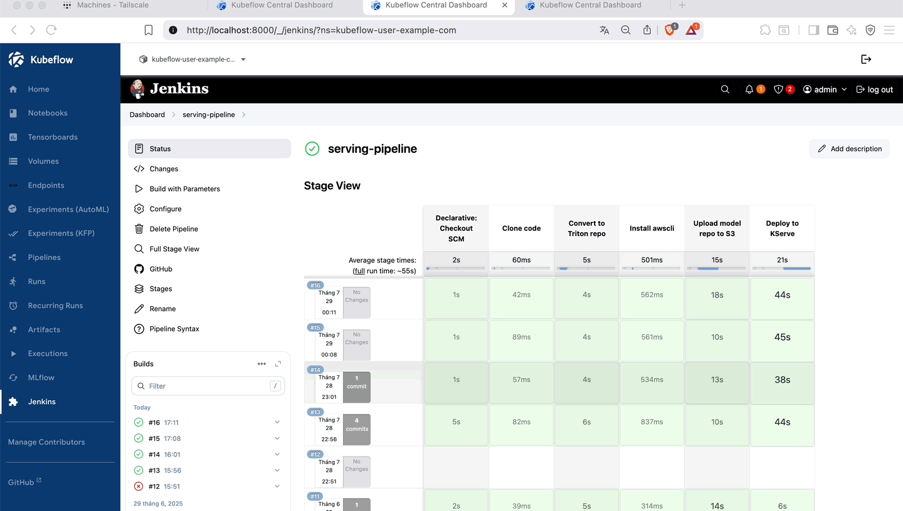
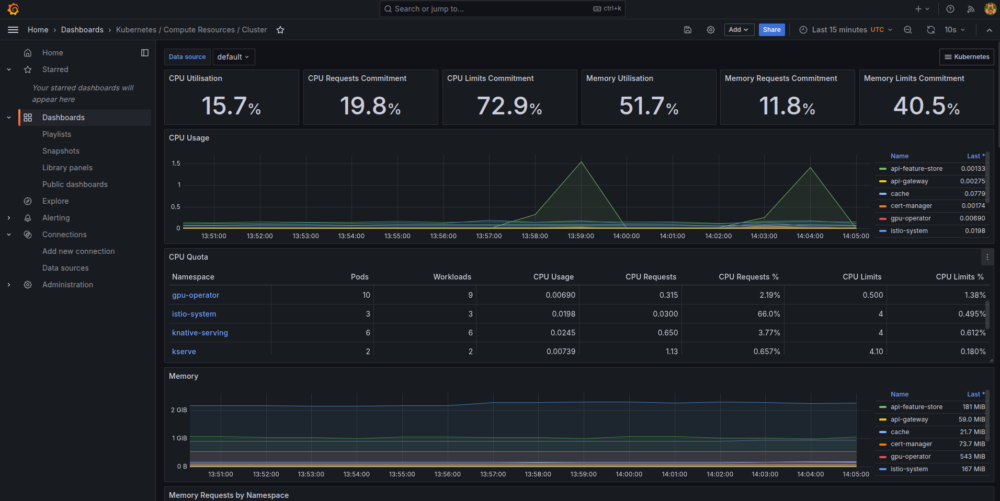
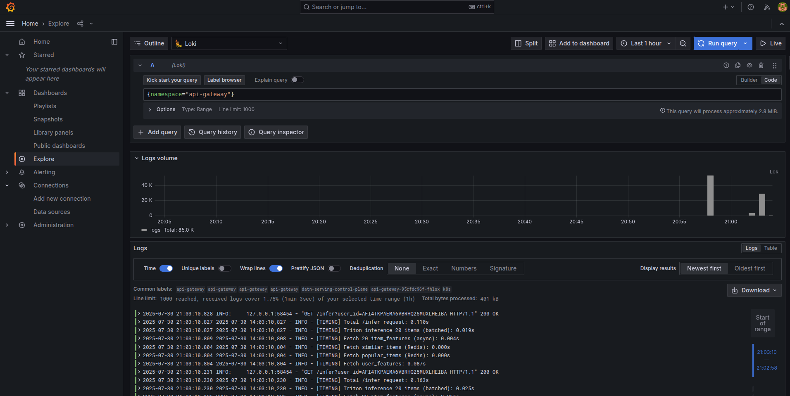
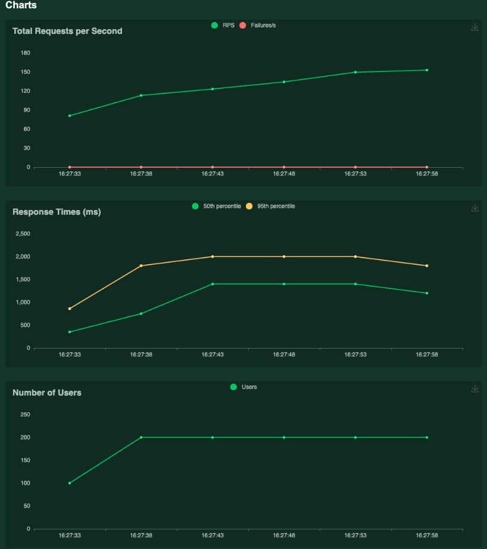
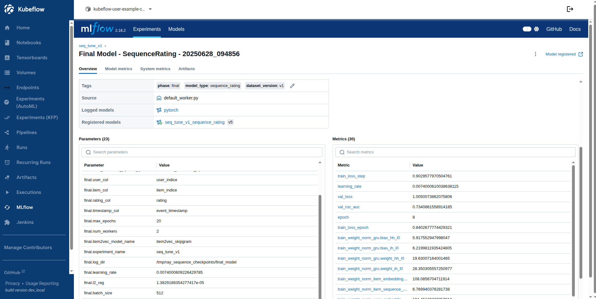

# AWS-SeqRec-MLOps

A **production-ready, end-to-end Recommender System pipeline** for scalable, cloud-native machine learning workflows. This project provides a robust MLOps architecture for building, training, deploying, and serving recommendation models in both research and production environments.

## 🏗️ Architecture

### Overall System Flow


### Serving Pipeline


### Offline Caching Pipeline


### Ranking Sequence Model Architecture


---

## 📝 System Overview

- **Comprehensive MLOps:** Data ingestion, feature engineering, model training, offline/online serving, monitoring.
- **Cloud-Native:** Supports both local (Kind) and cloud (EKS) Kubernetes clusters.
- **Modular Components:** Ray (distributed training), Kubeflow (orchestration), Feast (feature store), MLflow (experiment tracking), Jenkins (CI/CD), KServe/Triton (serving).
- **Scalable Caching:** Redis, S3 vector, Qdrant for high-performance caching.
- **Flexible API Gateway & UI:** RESTful API gateway and user-friendly UI.

---
## 📚 Table of Contents

1. [Quickstart](#-quickstart)
2. [Infrastructure Setup](#-infrastructure-setup)
3. [Data Pipeline & Feature Store](#-data-pipeline--feature-store)
4. [Kubeflow Pipeline Training](#-kubeflow-pipeline-training)
5. [Offline Caching](#-offline-caching)
6. [Serving Cluster & Model Serving](#-serving-cluster--model-serving)
7. [CI/CD & Jenkins Integration](#-cicd--jenkins-integration)
8. [API Gateway & UI](#-api-gateway--ui)
9. [Monitoring](#-monitoring)

---

## 📁 Repository Main Folder Structure
```txt
├── api_gateway                                        /* RESTful API gateway for routing requests and serving model predictions */
├── configs                                            /* Configuration files for models, pipelines, and settings (e.g., item2vec, ranking) */
├── data_pipeline_aws                                  /* AWS-based data pipeline code including Airflow, Glue, Lambda, DMS, Kinesis, and drift checking */
├── feature_store                                      /* Feast feature store setup, definitions, and API for managing online/offline features */
├── images                                             /* Architecture diagrams, pipeline visuals, and demo images/gifs */
│   ├── architect                                      /* Diagrams for system, serving, and caching architecture */
│   ├── data_pipeline                                  /* Screenshots and diagrams illustrating data pipeline steps */
│   └── setup                                          /* Images for setup and demos (e.g., Kubeflow, Jenkins, UI) */
├── jenkins-stack                                      /* Jenkins CI/CD setup with Helm chart, Dockerfile, and model promotion watcher pod */
├── mlflow-stack                                       /* MLflow tracking server with Helm chart, Dockerfile, and MinIO/Postgres configurations */
├── notebooks                                          /* Jupyter notebooks for data exploration, preparation, and upload tasks */
├── qdrant                                             /* Qdrant vector database Helm chart for vector search and similarity operations */
├── ray-cluster                                        /* Ray distributed training cluster with Helm chart and Dockerfile */
├── serving-cluster                                    /* Scripts and configs for KServe/Triton inference deployment on EKS/Kind */
│   └── terraform_eks                                  /* Terraform scripts for provisioning EKS serving cluster on AWS */
├── src                                                /* Core source code for logic, pipelines, and models */
│   ├── caching_offline                                /* Scripts and notebooks for offline vector caching to Redis/Qdrant/S3 */
│   ├── feature_engineer                               /* Feature engineering scripts, pipelines, and Dockerfile */
│   ├── kfp_pipeline                                   /* Kubeflow pipeline definitions and compiled YAML files */
│   ├── model_item2vec                                 /* Item2Vec model code, training scripts, and utilities */
│   ├── model_ranking_sequence                         /* Ranking sequence model code, training, and evaluation scripts */
├── terraform_ec2                                      /* Terraform scripts for provisioning EC2 instances, e.g., for UI deployment */
├── tests                                              /* Unit and integration tests for all major modules */
├── ui                                                 /* UI code for demo and visualization using Streamlit or Flask */
```
## 🚀 Quickstart 

### 1. Clone the Repository

```bash
git clone https://github.com/nguyenthai-duong/AWS-SeqRec-MLOps
cd AWS-SeqRec-MLOps
```

### 2. Set Up Python Environment

```bash
conda create -n recsys_ops python=3.11 -y
conda activate recsys_ops
```

### 3. Install Dependencies

```bash
pip install uv==0.6.2
uv sync --all-groups
```

### 4. Install Jupyter Kernel

```bash
python -m ipykernel install --user --name=datn-recsys --display-name="Python (datn-recsys)"
```

### 5. Pre-commit Hooks & Code Style

```bash
make precommit
make style
```

### 6. Run Unit Tests

```bash
make test
```

---

## 🤖 GitHub PR Agent Setup

Automate PR reviews with [PR Agent](https://github.com/Codium-ai/pr-agent):

1. **Add Secret:**  
   - Go to: `Settings → Secrets and variables → Actions → New repository secret`
   - Name: `OPENAI_API_KEY`
   - Value: *Paste your OpenAI API Key*

2. **Create Label:**  
   - Go to: `Issues → Labels → New label`
   - Name: `pr-agent/review`
   - Description: `Trigger PR Agent review on this PR`

3. **Usage:**  
   - Attach the `pr-agent/review` label to your PR.

---

## ☸️ Infrastructure Setup

### 1. NVIDIA Docker Runtime

```bash
curl -fsSL https://get.docker.com -o get-docker.sh
sudo sh get-docker.sh
sudo apt-get install -y nvidia-container-toolkit nvidia-docker2
sudo tee /etc/docker/daemon.json > /dev/null <<EOF
{
  "default-runtime": "nvidia",
  "runtimes": {
    "nvidia": {
      "path": "nvidia-container-runtime",
      "runtimeArgs": []
    }
  }
}
EOF
sudo systemctl daemon-reexec
sudo systemctl restart docker
docker info | grep -i runtime
```
*Expected Output: `Default Runtime: nvidia`*

### 2. Create Kind Cluster with GPU Support

To enable GPU workloads in your local Kind cluster, follow these steps:

1. **Configure NVIDIA Container Runtime**

Ensure the NVIDIA runtime accepts visible devices as volume mounts:

```bash
sudo sed -i '/accept-nvidia-visible-devices-as-volume-mounts/c\accept-nvidia-visible-devices-as-volume-mounts = true' /etc/nvidia-container-runtime/config.toml
```

2. **Create the Kind Cluster**

Create a Kind cluster with the necessary GPU device mounts:

```bash
kind create cluster --name datn-training1 --config - <<EOF
apiVersion: kind.x-k8s.io/v1alpha4
kind: Cluster
nodes:
  - role: control-plane
    image: kindest/node:v1.24.0
    extraMounts:
      - hostPath: /dev/null
        containerPath: /var/run/nvidia-container-devices/all
EOF
```

3. **Install NVIDIA GPU Operator**

Add the NVIDIA Helm repo and deploy the GPU operator (driverless mode):

```bash
helm repo add nvidia https://helm.ngc.nvidia.com/nvidia || true
helm repo update
helm install --wait --generate-name -n gpu-operator --create-namespace nvidia/gpu-operator --set driver.enabled=false
kubectl get pods -n gpu-operator
```

---

### 3. Install Kubeflow

1. **Clone and Deploy Kubeflow Manifests**

```bash
RELEASE=v1.7.0-rc.0
git clone -b $RELEASE --depth 1 --single-branch https://github.com/kubeflow/manifests.git
cd manifests
while ! kustomize build example | kubectl apply -f -; do echo "Retrying to apply resources"; sleep 10; done
```

2. **Fix Authservice Bug (if needed)**

If you encounter issues with the OIDC Authservice, rebuild and retag the image:

```bash
kubectl delete pod authservice-0 -n istio-system --grace-period=0 --force
git clone https://github.com/arrikto/oidc-authservice.git
make docker-build
docker tag gcr.io/arrikto-playground/kubeflow/oidc-authservice:0c4ea9a nthaiduong83/oidc-authservice:0c4ea9a
```
- Update the image reference in `manifests/common/oidc-authservice/base/statefulset.yaml`.
- If you see API version errors, change `autoscaling/v2beta2` to `autoscaling/v2` in the manifests.

3. **Increase inotify Limits (Recommended for Large Workloads)**

```bash
echo "fs.inotify.max_user_watches=524288" | sudo tee /etc/sysctl.d/99-kubeflow.conf
echo "fs.inotify.max_user_instances=512" | sudo tee -a /etc/sysctl.d/99-kubeflow.conf
sudo sysctl -p /etc/sysctl.d/99-kubeflow.conf
```


### 4. Ray Cluster Setup

```bash
helm repo add kuberay https://ray-project.github.io/kuberay-helm/
helm repo update
cd ray-cluster
docker build -t nthaiduong83/ray-cluster:v1 -f ray.Dockerfile .
kind load docker-image nthaiduong83/ray-cluster:v1 --name datn-training1
kubens kubeflow-user-example-com
helm install kuberay-operator kuberay/kuberay-operator --version 1.3.0
kubectl apply -f https://raw.githubusercontent.com/rancher/local-path-provisioner/master/deploy/local-path-storage.yaml
kubectl apply -f ray-pvc.yaml
kubectl apply -f ray-worker-pvc.yaml
helm install raycluster .
kubectl port-forward svc/raycluster-kuberay-head-svc 10001:10001 -n kubeflow-user-example-com
```

*Check GPU pods:*
```bash
kubectl get pods -n kubeflow-user-example-com -o json | jq '.items[] | select(.spec.containers[].resources.limits["nvidia.com/gpu"] != null) | .metadata.name'
```

---

### 5. MLflow & Jenkins Integration

#### Deploy MLflow Tracking Server

Build the MLflow Docker image, load it into your Kind cluster, and deploy using Helm:

```bash
docker build -t nthaiduong83/mlflow-kubeflow:v1 -f ./mlflow-stack/mlflow.Dockerfile .
kind load docker-image nthaiduong83/mlflow-kubeflow:v1 --name datn-training1
helm upgrade mlflow-stack ./mlflow-stack -n mlflow --install --create-namespace
```

#### Deploy Jenkins CI/CD Server

Build the Jenkins Docker image, load it into Kind, and deploy with Helm:

```bash
docker build -f ./jenkins-stack/Dockerfile.jenkins -t nthaiduong83/jenkins-datn:v1 .
kind load docker-image nthaiduong83/jenkins-datn:v1 --name datn-training1
helm upgrade jenkins-stack ./jenkins-stack -n devops-tools --install --create-namespace
```

**Retrieve Jenkins Admin Password:**

```bash
kubectl exec -n devops-tools -it jenkins-XXXXX -- cat /var/jenkins_home/secrets/initialAdminPassword
```
*(Replace `jenkins-XXXXX` with your Jenkins pod name.)*

#### Integrate MLflow & Jenkins into Kubeflow Dashboard

1. Export the current dashboard config:

   ```bash
   kubectl get configmap centraldashboard-config -n kubeflow -o yaml > dashboard-config.yaml
   ```

2. Add the following items to the `links` section in `dashboard-config.yaml`:

   ```yaml
   - type: item
     link: /mlflow/
     text: MLflow
     icon: icons:cached
   - type: item
     link: /jenkins/
     text: Jenkins
     icon: icons:extension
   ```

3. Apply the updated config and restart the dashboard:

   ```bash
   kubectl apply -f dashboard-config.yaml
   kubectl rollout restart deployment centraldashboard -n kubeflow
   ```

#### Access Kubeflow UI

Forward the Istio ingress gateway to access the Kubeflow dashboard locally:

```bash
kubectl port-forward svc/istio-ingressgateway 8000:80 -n istio-system
```
Then open [http://localhost:8000](http://localhost:8000) in your browser

---

## 📦 Data Pipeline & Feature Store

### 1. Data Pipeline on AWS

See [`data_pipeline_aws/README.md`](./data_pipeline_aws/README.md) for full details.

#### Example: Sync Airflow & UI to S3

```bash
aws s3 sync ./data_pipeline/airflow s3://datn-docker-compose/airflow --exclude "logs/*" --exclude "__pycache__/*" --exclude "*/__pycache__/*" --include "logs/.keep"
aws s3 sync ./ui s3://datn-docker-compose/ui --exclude "__pycache__/*" --exclude "*/__pycache__/*"
terraform init
terraform plan
terraform apply
```

### 2. Feature Store

```bash
MATERIALIZE_CHECKPOINT_TIME=$(uv run ./src/check_oltp_max_timestamp.py 2>&1 | awk -F'<ts>|</ts>' '{print $2}')
cd feature_store
export $(grep -v '^#' ../.env | xargs)
uv run feast apply
uv run feast materialize 2010-01-01T00:00:00 "$MATERIALIZE_CHECKPOINT_TIME"
```
#### Deploy feature store API in cluster serving

```bash
docker build -t nthaiduong83/feature-store-api:v3 -f feature_store_api.Dockerfile .
docker push nthaiduong83/feature-store-api:v3
kubectl create ns api-feature-store
kubectl create secret generic aws-credentials --from-env-file=../.env --namespace=api-feature-store
kubectl apply -f deployment.yaml
kubectl apply -f service.yaml
kubectl port-forward svc/feature-store-api-service 8005:80 -n api-feature-store
```
### Feature view


---
## 🧩 Kubeflow Pipeline Training

This section describes how to build and run the **Feature Engineering Pipeline** using Kubeflow Pipelines. The pipeline automates feature engineering, negative sampling, Item2Vec preparation, and model training steps for your recommender system.

---

### 1. Feature Engineering Pipeline (Kubeflow)

#### 1.1 Prepare Data on PVC

First, ensure your data and scripts are available on a Persistent Volume Claim (PVC):

```bash
cd src/feature_engineer
kubens kubeflow-user-example-com
kubectl apply -f pvc.yaml
kubectl apply -f copy-job.yaml
chmod +x copy-to-pvc.sh
./copy-to-pvc.sh
```

(Optional) Check the contents of the PVC:

```bash
kubectl apply -f - <<EOF
apiVersion: v1
kind: Pod
metadata:
  name: pvc-checker
spec:
  containers:
  - name: shell
    image: busybox
    command: ["sh", "-c", "sleep 3600"]
    volumeMounts:
    - name: data-volume
      mountPath: /data
  volumes:
  - name: data-volume
    persistentVolumeClaim:
      claimName: data-pvc
  restartPolicy: Never
EOF

kubectl exec -it pvc-checker -- sh
ls -lh /data
kubectl delete pod pvc-checker --force
```

#### 1.2 Build and Load Pipeline Image

```bash
kubectl create secret generic aws-credentials --from-env-file=.env -n kubeflow-user-example-com
docker build -t kubeflow-pipeline:v4 .
kind load docker-image kubeflow-pipeline:v4 --name datn-training1
```

#### 1.3 Compile and Upload Pipeline

```bash
cd src/kfp_pipeline
uv run run_pipeline.py
```

- This will generate `feature_pipeline.yaml`.
- Go to the Kubeflow Pipelines UI, create a new pipeline or experiment, upload `feature_pipeline.yaml`, and run it.

---

### 2. Pipeline Steps

The pipeline defined in [`src/kfp_pipeline/run_pipeline.py`](src/kfp_pipeline/run_pipeline.py) includes:

- **Feature Engineering**: Data transformation and feature extraction.
- **Negative Sampling**: Generate negative samples for training.
- **Item2Vec Preparation**: Prepare data for Item2Vec embedding.
- **Item2Vec Training**: Train the Item2Vec model.
- **Ranking Sequence Training**: Train the ranking model using sequential data.

Each step uses a shared PVC for data exchange and supports AWS credentials for S3/feature store access.


---

## 🗃️ Offline Caching

This system supports high-performance offline caching for vector search using either **Qdrant** or **S3 vector index** as the backend, and Redis as the serving cache.

### 1. Deploy Qdrant (Optional)

If you choose Qdrant as your vector store:

```bash
helm install qdrant ./qdrant --namespace kubeflow-user-example-com
kubectl port-forward svc/qdrant 6333:6333 -n kubeflow-user-example-com
```

### 2. Create S3 Vector Index (Optional)

If you choose S3 as your vector store:

- Create an S3 bucket: `recsys-ops-s3-vector`
- In the AWS S3 console, create a vector index with:
  - **Name:** `item2vec-index`
  - **Dimensions:** (e.g., 1024)
  - **Distance metric:** cosine similarity
  - **Metadata:** filterable (category, date), non-filterable (description)

### 3. Deploy Redis to Serving Cluster

Redis is used as the online cache for fast retrieval:

```bash
kubectl create ns cache
helm repo add bitnami https://charts.bitnami.com/bitnami
helm install redis bitnami/redis --version 21.0.2 --namespace cache --set-string auth.password=123456 --set master.service.type=LoadBalancer
kubectl port-forward svc/redis-master 6379:6379 -n cache
```

### 4. Run Offline Caching Pipeline

Depending on your vector backend, run the appropriate pipeline to load vectors into Redis:

- **For Qdrant:**  
  Execute: `src/caching_offline/load2redis_qdrant.ipynb`
- **For S3 Vector:**
  Execute: `src/caching_offline/load2redis_s3_vector.ipynb`

## 🏗️ Serving Cluster & Model Serving

This section guides you through setting up the serving cluster and deploying the model serving stack using either AWS EKS (recommended for production) or a local Kind cluster for development and testing.

---

### 🚀 Option 1: EKS (Recommended for Production)

- Provision an EKS cluster using Terraform scripts in the `serving-cluster` directory.
- Follow your organization's Terraform workflow to apply the infrastructure as code.

---

### 🖥️ Option 2: Local (Kind)

Set up a local Kubernetes cluster with GPU support using Kind:

```bash
kind create cluster --name datn-serving --config - <<EOF
apiVersion: kind.x-k8s.io/v1alpha4
kind: Cluster
nodes:
- role: control-plane
  image: kindest/node:v1.26.3
  extraMounts:
    - hostPath: /dev/null
      containerPath: /var/run/nvidia-container-devices/all
EOF

helm repo add nvidia https://helm.ngc.nvidia.com/nvidia || true
helm repo update
helm install --wait --generate-name -n gpu-operator --create-namespace nvidia/gpu-operator --set driver.enabled=false
docker info | grep -i runtime
```

---

### 🧩 Deploy KServe & Triton Inference Server

#### 1. Upload Triton Model Repository to S3

```bash
aws s3 rm s3://recsys-triton-repo/ --recursive || true
aws s3 sync /home/duong/Documents/datn/sequence_modeling/model_repository/ s3://ecsys-triton-repo/
touch .keep
aws s3 cp .keep s3://ecsys-triton-repo/ensemble/1/.keep
```

#### 2. Install KServe and Build Triton Image

```bash
kubectx kind-datn-serving
cd serving-cluster
./deploy_kserve.sh
docker build -t tritonserver-datn:v4 . -f Dockerfile.triton
kind load docker-image tritonserver-datn:v4 --name datn-serving
kubectl create secret generic aws-credentials --from-env-file=../../.env --namespace=kserve
```

#### 3. Deploy Inference Service

```bash
kubectl apply -f inferenceservice-triton-gpu.yaml
```

---

## ⚙️ CI/CD & Jenkins Integration

This section describes how to set up CI/CD automation for your MLOps workflow using Jenkins, including secure AWS credential management and automated model promotion.

---

### 1. Configure AWS Credentials in Jenkins

1. Go to **Jenkins > Manage Jenkins > Manage Plugins** and ensure the **AWS Credentials Plugin** is installed.
2. Navigate to **Manage Jenkins > Manage Credentials**.
3. Add a new credential:
   - **Kind:** AWS Credentials
   - **Scope:** Global
   - **ID:** `aws-credentials`
   - **Access Key ID:** Enter your `AWS_ACCESS_KEY_ID`
   - **Secret Access Key:** Enter your `AWS_SECRET_ACCESS_KEY`
   - Save the credential.

---

### 2. Export Kubernetes Cluster Credentials

Export kubeconfig files for Jenkins to interact with your clusters:

```bash
kind get kubeconfig --name datn-cluster > kind_kubeconfig.yaml
kind get kubeconfig --name datn-serving --internal > kubeconfig-serving.yaml
```

---

### 3. Jenkins Plugins & Pipeline Setup

- Install the following Jenkins plugins: **Docker Pipeline**, **Kubernetes CLI**, **Stage View**.
- Create a pipeline from SCM (Source Control Management), add the necessary credentials, and run your pipeline.

---

### 4. Port-forward Triton Predictor (for Testing)

To access the deployed Triton inference service:

```bash
kubectl port-forward pod/recsys-triton-predictor-XXXXX 8001:8001 -n kserve
```
*(Replace `recsys-triton-predictor-XXXXX` with your actual pod name.)*

---

### 5. Model Promotion Watcher (Auto-trigger Jenkins Pipeline)

Automate model promotion and deployment with a watcher pod:

```bash
docker build -f Dockerfile.watcher -t nthaiduong83/model-promotion-watcher:v1 .
kind load docker-image nthaiduong83/model-promotion-watcher:v1 --name datn-training1
kubectl apply -f deployment.yaml
kubectl apply -f service.yaml
```

> **Note:**  
> In your Jenkins job, set the string parameters: `MODEL_NAME` and `MODEL_VERSION` as required for model promotion.


---

## 🌐 API Gateway & UI

### API Gateway

```bash
cd api_gateway
docker build -t nthaiduong83/api-gateway:v5 .
kind load docker-image nthaiduong83/api-gateway:v5 --name datn-serving
kubectl create ns api-gateway
kubectl apply -f deployment.yaml
kubectl apply -f service.yaml
kubectl port-forward svc/api-gateway-service 8009:80 -n api-gateway
```

### UI

- SSH to EC2 is deployed using `terraform_ec2` and run UI.
- 

---

## 📊 Monitoring

1. **Install LGTM Stack Locally**:
   ```bash
   git clone https://github.com/daviaraujocc/lgtm-stack.git
   cd lgtm-stack
   make install-local # testing
   ```
2. **Retrieve Grafana Admin Password: Use the following command to get the admin password for Grafana:**
```bash
kubectl get secret -n monitoring lgtm-grafana -o jsonpath="{.data.admin-password}" | base64 -d
```
Default username: `admin`

3. **Apply Promtail Configuration: Apply the fixed Promtail configuration in the monitoring namespace:**
```bash
kubectl apply -f manifests/promtail.cri.yaml -n monitoring
```
4. **Grafana Dashboard:**
- 
5. **Loki Logs:**
- 

#### Throughput and performance of model
Run Locust Test: Execute the Locust test using the provided `locustfile.py`
- 
- 


