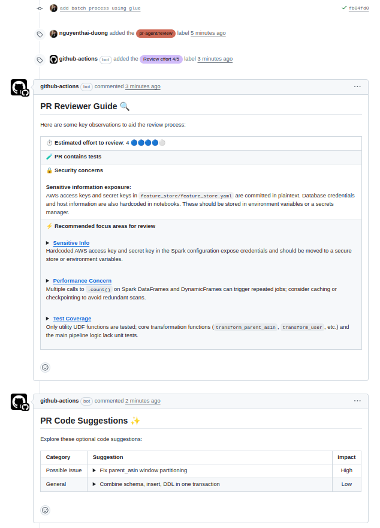

# datn-recsys

**Product-ready Recommender System pipeline.**

---

## 🚀 Quickstart

```bash
# 1. Clone repo
git clone https://github.com/nguyenthai-duong/AWS-SeqRec-MLOps
cd AWS-SeqRec-MLOps

conda create -n recsys_ops python=3.11 -y
conda activate recsys_ops
pip install uv==0.6.2
uv sync --all-groups
python -m ipykernel install --user --name=datn-recsys --display-name="Python (datn-recsys)"
```

# 4. Cài pre-commit (khuyến nghị, auto lint trước khi commit)
make precommit

# 6. Check style/lint toàn bộ code & notebook
make style

# 7. Chạy unit test
make test


Setup pr agent github (https://github.com/qodo-ai/pr-agent)

Vào Settings → Secrets and variables → Actions -> New repository secret
Name: OPENAI_API_KEY
Value: dán OpenAI API Key của bạn

Tạo label:  Issues → Labels
Bấm New label

    Name: pr-agent/review

    Color: để mặc định hoặc chọn tuỳ ý

    Description: “Trigger PR Agent review on this PR”

Bấm Create label
Gắn label: pr-agent/review khi tạo Pull Request




## Thiết lập hạ tầng Kind cluster & Kubeflow

### Cài docker runtime nvidia
curl -fsSL https://get.docker.com -o get-docker.sh
sudo sh get-docker.sh
sudo apt-get install -y nvidia-container-toolkit nvidia-docker2
sudo tee /etc/docker/daemon.json > /dev/null <<EOF
{
  "default-runtime": "nvidia",
  "runtimes": {
    "nvidia": {
      "path": "nvidia-container-runtime",
      "runtimeArgs": []
    }
  }
}
EOF
sudo systemctl daemon-reexec
sudo systemctl restart docker

### check
docker info | grep -i runtime
```
 Runtimes: runc io.containerd.runc.v2 nvidia
 Default Runtime: nvidia
```

### Tạo cluster Kind sử dụng GPU
sudo sed -i '/accept-nvidia-visible-devices-as-volume-mounts/c\accept-nvidia-visible-devices-as-volume-mounts = true' /etc/nvidia-container-runtime/config.toml

kind create cluster --name datn-training1 --config - <<EOF
apiVersion: kind.x-k8s.io/v1alpha4
kind: Cluster
nodes:
- role: control-plane
  image: kindest/node:v1.24.0
  extraMounts:
    - hostPath: /dev/null
      containerPath: /var/run/nvidia-container-devices/all
EOF

helm repo add nvidia https://helm.ngc.nvidia.com/nvidia || true
helm repo update
helm install --wait --generate-name \
     -n gpu-operator --create-namespace \
     nvidia/gpu-operator --set driver.enabled=false
### check
kubectl get pods -n gpu-operator


## Kubeflow
RELEASE=v1.7.0-rc.0
git clone -b $RELEASE --depth 1 --single-branch https://github.com/kubeflow/manifests.git
cd manifests
while ! kustomize build example | kubectl apply -f -; do echo "Retrying to apply resources"; sleep 10; done

### fix bug
Pod authservice-0 cannot is pulled from  "gcr.io/arrikto/kubeflow/oidc-authservice:28c59ef" -> rebuild
kubectl delete pod authservice-0 -n istio-system --grace-period=0 --force
git clone https://github.com/arrikto/oidc-authservice.git
make docker-build
docker tag gcr.io/arrikto-playground/kubeflow/oidc-authservice:0c4ea9a nthaiduong83/oidc-authservice:0c4ea9a
change: nthaiduong83/oidc-authservice:0c4ea9a in manifests/common/oidc-authservice/base/statefulset.yaml
change  autoscaling/v2beta2 → autoscaling/v2

### if have error too many open files 
xem giá trị hiện tại của các thông số:
sysctl fs.inotify.max_user_watches
sysctl fs.inotify.max_user_instances

# thêm
echo "fs.inotify.max_user_watches=524288" | sudo tee /etc/sysctl.d/99-kubeflow.conf
echo "fs.inotify.max_user_instances=512" | sudo tee -a /etc/sysctl.d/99-kubeflow.conf

sudo sysctl -p /etc/sysctl.d/99-kubeflow.conf

## Ray cluster
helm repo add kuberay https://ray-project.github.io/kuberay-helm/
helm repo update
cd ray-cluster
docker build -t nthaiduong83/ray-cluster:v1 -f ray.Dockerfile .
kind load docker-image nthaiduong83/ray-cluster:v1 --name datn-training1
# Install both CRDs and KubeRay operator v1.3.0.
kubens kubeflow-user-example-com
helm install kuberay-operator kuberay/kuberay-operator --version 1.3.0
kubectl apply -f https://raw.githubusercontent.com/rancher/local-path-provisioner/master/deploy/local-path-storage.yaml
kubectl apply -f ray-pvc.yaml
kubectl apply -f ray-worker-pvc.yaml
helm install raycluster .

kubectl port-forward svc/raycluster-kuberay-head-svc 10001:10001 -n kubeflow-user-example-com


## Cài đặt mlflow
docker build -t nthaiduong83/mlflow-kubeflow:v1 -f ./mlflow-stack/mlflow.Dockerfile .
kind load docker-image nthaiduong83/mlflow-kubeflow:v1 --name datn-training1

helm upgrade mlflow-stack ./mlflow-stack -n mlflow --install --create-namespace

## Cài đặt Jenkins
docker build -f ./jenkins-stack/Dockerfile.jenkins -t nthaiduong83/jenkins-datn:v1 . 
kind load docker-image nthaiduong83/jenkins-datn:v1 --name datn-training1

helm upgrade jenkins-stack ./jenkins-stack -n devops-tools --install --create-namespace

## Lấy key
kubectl exec -n devops-tools -it jenkins-55f88b6b77-6xxnc -- cat /var/jenkins_home/secrets/initialAdminPassword
-> 7f225be7156d4207a59ed6f4960140f2
Sau đó install suggestion


## cài giao diện mlflow và jenkins vào dashboard kubeflow: 
kubectl get configmap centraldashboard-config -n kubeflow -o yaml > dashboard-config.yaml

<!-- 
{
"type": "item",
"link": "/mlflow/",
"text": "MLflow",
"icon": "icons:cached"
},
{
"type": "item",
"link": "/jenkins/",
"text": "Jenkins",
"icon": "icons:extension"
}  -->

kubectl apply -f dashboard-config.yaml
kubectl rollout restart deployment centraldashboard -n kubeflow


### open kubeflow ui
kubectl port-forward svc/istio-ingressgateway 8000:80 -n istio-system


## Thiết lập data pipleline
Vui lòng xem chi tiết tại: ./data_pipeline_aws/README.md


## Thiết lập cluster for serving (local)
kind create cluster --name datn-serving --config - <<EOF
apiVersion: kind.x-k8s.io/v1alpha4
kind: Cluster
nodes:
- role: control-plane
  image: kindest/node:v1.26.3
  extraMounts:
    - hostPath: /dev/null
      containerPath: /var/run/nvidia-container-devices/all
EOF

helm repo add nvidia https://helm.ngc.nvidia.com/nvidia || true
helm repo update
helm install --wait --generate-name \
     -n gpu-operator --create-namespace \
     nvidia/gpu-operator --set driver.enabled=false


## Thiết lập feature store

MATERIALIZE_CHECKPOINT_TIME=$(uv run ./src/check_oltp_max_timestamp.py 2>&1 | awk -F'<ts>|</ts>' '{print $2}')
echo "MATERIALIZE_CHECKPOINT_TIME=$MATERIALIZE_CHECKPOINT_TIME"
2022-06-14 05:27:26.678000+00:00

cd feature_store
### nạp aws key và postgres path
export $(grep -v '^#' ../.env | xargs)
uv run feast apply
uv run feast materialize 2010-01-01T00:00:00 "$MATERIALIZE_CHECKPOINT_TIME"


docker build -t nthaiduong83/feature-store-api:v3 -f feature_store_api.Dockerfile .

docker push nthaiduong83/feature-store-api:v3

kubectl create ns api-feature-store
kubectl create secret generic aws-credentials --from-env-file=../.env --namespace=api-feature-store

kubectl apply -f deployment.yaml
kubectl apply -f service.yaml

kubectl port-forward svc/feature-store-api-service 8005:80 -n api-feature-store


# Thiết lập feature engineering pipeline kubeflow

cd src/feature_engineer
kubens kubeflow-user-example-com
kubectl apply -f pvc.yaml
kubectl get pvc
kubectl apply -f copy-job.yaml
### Upload raw data into pvc
chmod +x copy-to-pvc.sh
./copy-to-pvc.sh
### Chech pvc
kubectl apply -f - <<EOF
apiVersion: v1
kind: Pod
metadata:
  name: pvc-checker
spec:
  containers:
  - name: shell
    image: busybox
    command: ["sh", "-c", "sleep 3600"]
    volumeMounts:
    - name: data-volume
      mountPath: /data
  volumes:
  - name: data-volume
    persistentVolumeClaim:
      claimName: data-pvc
  restartPolicy: Never
EOF

kubectl exec -it pvc-checker -- sh
ls -lh /data
kubectl delete pod pvc-checker --force

docker build -f src/feature_engineer/feature_pipeline.Dockerfile -t nthaiduong83/feature_pipeline:v2 .
kind load docker-image nthaiduong83/feature_pipeline:v6 --name datn-training1

kubectl create secret generic aws-credentials --from-env-file=.env -n kubeflow-user-example-com

cd src/kfp_pipeline
uv run run_pipeline.py

### Load caching offline Redis
Dựng pod qdrant và mở cổng: 
helm install qdrant ./qdrant --namespace kubeflow-user-example-com
kubectl port-forward svc/qdrant 6333:6333 -n kubeflow-user-example-com
Ở cluster training, mở 2 port mlflow và minio để pipeline caching offline lấy được model item2vec
kubectl port-forward --address 127.0.0.1 svc/minio-service 9010:9000 -n mlflow
kubectl port-forward svc/mlflow-tracking-service -n mlflow 5002:5000 

Chuyển sang cluster serving, sau đó tạo pod redis
kubectx kind-datn-serving
kubectl create ns cache
helm repo add bitnami https://charts.bitnami.com/bitnami
helm repo update
helm install redis bitnami/redis \
  --version 21.0.2 \
  --namespace cache \
  --set-string auth.password=123456 \
  --set master.service.type=LoadBalancer

kubectl port-forward svc/redis-master 6379:6379 -n cache

Run pipeline caching offline trong notebook `src/caching_offline/load2redis.ipynb`


