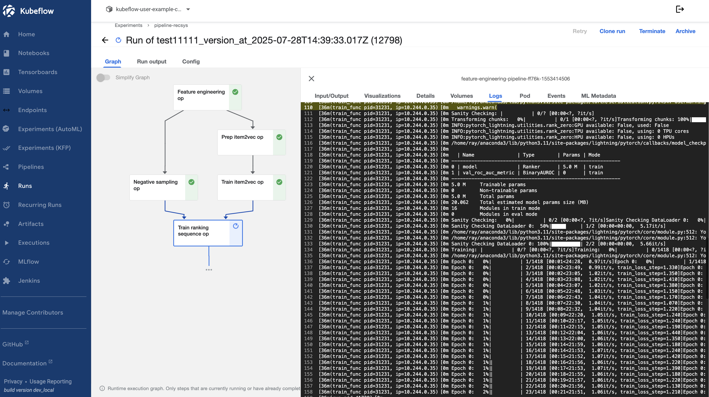

# AWS-RecSys

A **production-ready, end-to-end Recommender System pipeline** designed for scalable, cloud-native machine learning workflows. This project provides a robust MLOps architecture for building, training, deploying, and serving recommendation models in both research and production environments.

---

## 📊 System Overview

- **Comprehensive MLOps:** Integrates data ingestion, feature engineering, model training, offline/online serving, and monitoring.
- **Cloud-Native:** Supports both local (Kind) and cloud (EKS) Kubernetes clusters with GPU acceleration.
- **Modular Components:** Includes Ray for distributed training, Kubeflow for orchestration, Feast for feature store, MLflow for experiment tracking, Jenkins for CI/CD, and KServe/Triton for model serving.
- **Scalable Caching:** Utilizes Redis and Qdrant for high-performance offline and vector caching.
- **Flexible API Gateway & UI:** Provides a RESTful API gateway and a user-friendly UI for interaction and visualization.

---

## 📈 Architecture
*Overall system flow*


*Serving pipeline*


*Offline caching pipeline*


*Ranking sequence model architecture*


---
## 🚀 Quickstart

### 1. Clone the Repository

```bash
git clone https://github.com/nguyenthai-duong/AWS-SeqRec-MLOps
cd AWS-SeqRec-MLOps
```

### 2. Set Up Python Environment

```bash
conda create -n recsys_ops python=3.11 -y
conda activate recsys_ops
```

### 3. Install Dependencies

```bash
pip install uv==0.6.2
uv sync --all-groups
```

### 4. Install Jupyter Kernel

```bash
python -m ipykernel install --user --name=datn-recsys --display-name="Python (datn-recsys)"
```

### 5. Pre-commit Hooks (Recommended)

```bash
make precommit
```

### 6. Code Style & Lint

```bash
make style
```

### 7. Run Unit Tests

```bash
make test
```

---

## 🤖 GitHub PR Agent Setup

Automate PR reviews with [PR Agent](https://github.com/Codium-ai/pr-agent):

1. **Add Secret:**  
   - Go to: `Settings → Secrets and variables → Actions → New repository secret`
   - Name: `OPENAI_API_KEY`
   - Value: *Paste your OpenAI API Key*

2. **Create Label:**  
   - Go to: `Issues → Labels → New label`
   - Name: `pr-agent/review`
   - Description: `Trigger PR Agent review on this PR`

3. **Usage:**  
   - Attach the `pr-agent/review` label to your PR.

---

## ☸️ Infrastructure Setup

### 1. NVIDIA Docker Runtime

```bash
curl -fsSL https://get.docker.com -o get-docker.sh
sudo sh get-docker.sh
sudo apt-get install -y nvidia-container-toolkit nvidia-docker2
sudo tee /etc/docker/daemon.json > /dev/null <<EOF
{
  "default-runtime": "nvidia",
  "runtimes": {
    "nvidia": {
      "path": "nvidia-container-runtime",
      "runtimeArgs": []
    }
  }
}
EOF
sudo systemctl daemon-reexec
sudo systemctl restart docker
docker info | grep -i runtime
```
*Expected Output: `Default Runtime: nvidia`*

---

### 2. Create Kind Cluster with GPU Support

```bash
sudo sed -i '/accept-nvidia-visible-devices-as-volume-mounts/c\accept-nvidia-visible-devices-as-volume-mounts = true' /etc/nvidia-container-runtime/config.toml

kind create cluster --name datn-training1 --config - <<EOF
apiVersion: kind.x-k8s.io/v1alpha4
kind: Cluster
nodes:
- role: control-plane
  image: kindest/node:v1.24.0
  extraMounts:
    - hostPath: /dev/null
      containerPath: /var/run/nvidia-container-devices/all
EOF
```

```bash
helm repo add nvidia https://helm.ngc.nvidia.com/nvidia || true
helm repo update
helm install --wait --generate-name -n gpu-operator --create-namespace nvidia/gpu-operator --set driver.enabled=false
kubectl get pods -n gpu-operator
```

---

### 3. Install Kubeflow

```bash
RELEASE=v1.7.0-rc.0
git clone -b $RELEASE --depth 1 --single-branch https://github.com/kubeflow/manifests.git
cd manifests
while ! kustomize build example | kubectl apply -f -; do echo "Retrying to apply resources"; sleep 10; done
```

#### Fix Authservice Bug

```bash
kubectl delete pod authservice-0 -n istio-system --grace-period=0 --force
git clone https://github.com/arrikto/oidc-authservice.git
make docker-build
docker tag gcr.io/arrikto-playground/kubeflow/oidc-authservice:0c4ea9a nthaiduong83/oidc-authservice:0c4ea9a
```
- Update `manifests/common/oidc-authservice/base/statefulset.yaml` to use the new image.
- Change `autoscaling/v2beta2` to `autoscaling/v2` in manifests if needed.

#### Increase inotify Limits

```bash
echo "fs.inotify.max_user_watches=524288" | sudo tee /etc/sysctl.d/99-kubeflow.conf
echo "fs.inotify.max_user_instances=512" | sudo tee -a /etc/sysctl.d/99-kubeflow.conf
sudo sysctl -p /etc/sysctl.d/99-kubeflow.conf
```

---

### 4. Ray Cluster Setup

```bash
helm repo add kuberay https://ray-project.github.io/kuberay-helm/
helm repo update
cd ray-cluster
docker build -t nthaiduong83/ray-cluster:v1 -f ray.Dockerfile .
kind load docker-image nthaiduong83/ray-cluster:v1 --name datn-training1
kubens kubeflow-user-example-com
helm install kuberay-operator kuberay/kuberay-operator --version 1.3.0
kubectl apply -f https://raw.githubusercontent.com/rancher/local-path-provisioner/master/deploy/local-path-storage.yaml
kubectl apply -f ray-pvc.yaml
kubectl apply -f ray-worker-pvc.yaml
helm install raycluster .
kubectl port-forward svc/raycluster-kuberay-head-svc 10001:10001 -n kubeflow-user-example-com
```

*Check GPU pods:*
```bash
kubectl get pods -n kubeflow-user-example-com -o json | jq '.items[] | select(.spec.containers[].resources.limits["nvidia.com/gpu"] != null) | .metadata.name'
```

---

### 5. MLflow & Jenkins Integration

#### MLflow

```bash
docker build -t nthaiduong83/mlflow-kubeflow:v1 -f ./mlflow-stack/mlflow.Dockerfile .
kind load docker-image nthaiduong83/mlflow-kubeflow:v1 --name datn-training1
helm upgrade mlflow-stack ./mlflow-stack -n mlflow --install --create-namespace
```

#### Jenkins

```bash
docker build -f ./jenkins-stack/Dockerfile.jenkins -t nthaiduong83/jenkins-datn:v1 .
kind load docker-image nthaiduong83/jenkins-datn:v1 --name datn-training1
helm upgrade jenkins-stack ./jenkins-stack -n devops-tools --install --create-namespace
```

*Retrieve Jenkins Admin Password:*
```bash
kubectl exec -n devops-tools -it jenkins-XXXXX -- cat /var/jenkins_home/secrets/initialAdminPassword
```

#### Integrate into Kubeflow Dashboard

- Edit `centraldashboard-config` ConfigMap to add MLflow and Jenkins links.
- Apply and restart dashboard:

```bash
kubectl apply -f dashboard-config.yaml
kubectl rollout restart deployment centraldashboard -n kubeflow
```

#### Access Kubeflow UI

```bash
kubectl port-forward svc/istio-ingressgateway 8000:80 -n istio-system
```

---

## 📦 Data Pipeline & Feature Store

### 1. Data Pipeline on AWS

See `./data_pipeline_aws/README.md` for details.

#### Example: Sync Airflow & UI to S3

```bash
aws s3 sync ./data_pipeline/airflow s3://datn-docker-compose/airflow --exclude "logs/*" --exclude "__pycache__/*" --exclude "*/__pycache__/*" --include "logs/.keep"
aws s3 sync ./ui s3://datn-docker-compose/ui --exclude "__pycache__/*" --exclude "*/__pycache__/*"
terraform init
terraform plan
terraform apply
```

---

### 2. Serving Cluster

#### 2.1 Local (Kind)

To deploy a local serving cluster with GPU support using Kind:

```bash
kind create cluster --name datn-serving --config - <<EOF
apiVersion: kind.x-k8s.io/v1alpha4
kind: Cluster
nodes:
  - role: control-plane
    image: kindest/node:v1.26.3
    extraMounts:
      - hostPath: /dev/null
        containerPath: /var/run/nvidia-container-devices/all
EOF

helm repo add nvidia https://helm.ngc.nvidia.com/nvidia || true
helm repo update
helm install --wait --generate-name \
  -n gpu-operator --create-namespace \
  nvidia/gpu-operator --set driver.enabled=false
```

#### 2.2 AWS EKS

To deploy the serving cluster on AWS EKS using Terraform:

```bash
cd terraform_eks
terraform init
terraform plan
terraform apply
```
---

### 3. Feature Store

```bash
MATERIALIZE_CHECKPOINT_TIME=$(uv run ./src/check_oltp_max_timestamp.py 2>&1 | awk -F'<ts>|</ts>' '{print $2}')
cd feature_store
export $(grep -v '^#' ../.env | xargs)
uv run feast apply
uv run feast materialize 2010-01-01T00:00:00 "$MATERIALIZE_CHECKPOINT_TIME"
```
#### Deploy feature store api in cluster serving
```bash
docker build -t nthaiduong83/feature-store-api:v3 -f feature_store_api.Dockerfile .
docker push nthaiduong83/feature-store-api:v3
kubectl create ns api-feature-store
kubectl create secret generic aws-credentials --from-env-file=../.env --namespace=api-feature-store
kubectl apply -f deployment.yaml
kubectl apply -f service.yaml
kubectl port-forward svc/feature-store-api-service 8005:80 -n api-feature-store
```

---

### 4. Feature Engineering Pipeline (Kubeflow)

```bash
cd src/feature_engineer
kubens kubeflow-user-example-com
kubectl apply -f pvc.yaml
kubectl apply -f copy-job.yaml
chmod +x copy-to-pvc.sh
./copy-to-pvc.sh
kubectl apply -f - <<EOF
apiVersion: v1
kind: Pod
metadata:
  name: pvc-checker
spec:
  containers:
  - name: shell
    image: busybox
    command: ["sh", "-c", "sleep 3600"]
    volumeMounts:
    - name: data-volume
      mountPath: /data
  volumes:
  - name: data-volume
    persistentVolumeClaim:
      claimName: data-pvc
  restartPolicy: Never
EOF
kubectl exec -it pvc-checker -- sh
ls -lh /data
kubectl delete pod pvc-checker --force
```

*Build and load images:*
```bash
kubectl create secret generic aws-credentials --from-env-file=.env -n kubeflow-user-example-com
docker build -t kubeflow-pipeline:v4 .
kind load docker-image kubeflow-pipeline:v4 --name datn-training1
cd src/kfp_pipeline
uv run run_pipeline.py
```
Tạo pipeline, experiment, upload file feature_pipeline.yaml lên và run



---

## 🗃️ Offline Caching with Redis & Qdrant / S3 vector

### 1.1 Deploy Qdrant

```bash
helm install qdrant ./qdrant --namespace kubeflow-user-example-com
kubectl port-forward svc/qdrant 6333:6333 -n kubeflow-user-example-com
```

### 1.2 Vector Index

- Create S3 bucket: `recsys-ops-s3-vector`
- In AWS S3 console, create vector index:
  - Name: `item2vec-index`
  - Dimensions: *e.g.,* 1024
  - Distance metric: cosine similarity
  - Metadata: filterable (category, date), non-filterable (description)

### 2. Expose MLflow & MinIO (Training Cluster)

```bash
kubectl port-forward --address 127.0.0.1 svc/minio-service 9010:9000 -n mlflow
kubectl port-forward svc/mlflow-tracking-service -n mlflow 5002:5000
```

### 3. Deploy Redis (Serving Cluster)

```bash
kubectx kind-datn-serving
kubectl create ns cache
helm repo add bitnami https://charts.bitnami.com/bitnami
helm repo update
helm install redis bitnami/redis --version 21.0.2 --namespace cache --set-string auth.password=123456 --set master.service.type=LoadBalancer
kubectl port-forward svc/redis-master 6379:6379 -n cache
```

### 4. Run Offline Caching Pipeline

- Execute: `src/caching_offline/load2redis.ipynb`

---

## 🏗️ Serving Cluster Build

### Option 1: EKS (Recommended for Production)

- [Instructions for EKS setup here...]

### Option 2: Local (Kind)

```bash
kind create cluster --name datn-serving --config - <<EOF
apiVersion: kind.x-k8s.io/v1alpha4
kind: Cluster
nodes:
- role: control-plane
  image: kindest/node:v1.26.3
  extraMounts:
    - hostPath: /dev/null
      containerPath: /var/run/nvidia-container-devices/all
EOF
helm repo add nvidia https://helm.ngc.nvidia.com/nvidia || true
helm repo update
helm install --wait --generate-name -n gpu-operator --create-namespace nvidia/gpu-operator --set driver.enabled=false
docker info | grep -i runtime
```

---

### Deploy KServe & Triton
#### Upload triton repo
```bash
aws s3 rm s3://recsys-triton-repo/ --recursive || true
aws s3 sync /home/duong/Documents/datn/sequence_modeling/model_repository/ s3://ecsys-triton-repo/
touch .keep
aws s3 cp .keep s3://ecsys-triton-repo/ensemble/1/.keep
```

#### Install kserve
```bash
kubectx kind-datn-serving
cd serving-cluster
./deploy_kserve.sh
docker build -t tritonserver-datn:v4 . -f Dockerfile.triton
kind load docker-image tritonserver-datn:v4 --name datn-serving
kubectl create secret generic aws-credentials --from-env-file=../../.env --namespace=kserve
```


---


## Lấy credential k8s cluster
kind get kubeconfig --name datn-cluster > kind_kubeconfig.yaml

### Jenkins Pipeline for CI/CD
Cấu hình AWS Credentials trong Jenkins
Vào Jenkins > Manage Jenkins > Manage Plugins, đảm bảo đã cài AWS Credentials Plugin.
Vào Manage Jenkins > Manage Credentials:
Thêm một Credential mới:
Kind: AWS Credentials.
Scope: Global.
ID: aws-credentials.
Access Key ID: Nhập giá trị AWS_ACCESS_KEY_ID.
Secret Access Key: Nhập giá trị AWS_SECRET_ACCESS_KEY.
Lưu lại.

```bash
kind get kubeconfig --name datn-serving --internal > kubeconfig-serving.yaml
```
- Install plugins: Docker Pipeline, Kubernetes CLI, Stage View.
- Create pipeline from SCM, add credentials, and run.

*Port-forward Triton predictor:*
```bash
kubectl port-forward pod/recsys-triton-predictor-XXXXX 8001:8001 -n kserve
```

---

## 🌐 API Gateway

```bash
cd api_gateway
docker build -t nthaiduong83/api-gateway:v5 .
kind load docker-image nthaiduong83/api-gateway:v5 --name datn-serving
kubectl create ns api-gateway
kubectl apply -f deployment.yaml
kubectl apply -f service.yaml
kubectl port-forward svc/api-gateway-service 8009:80 -n api-gateway
```

---

## 🖥️ UI

```bash
cd ui
conda create -n ui -y
conda activate ui
pip install -r requirements.txt
```

---


---
