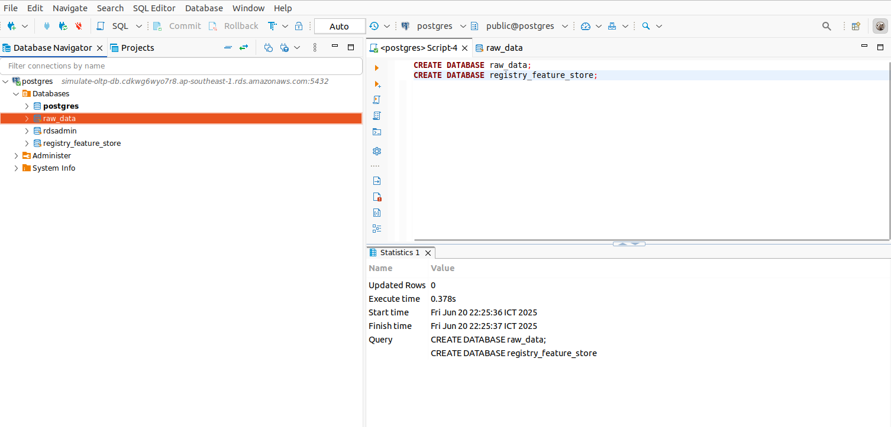
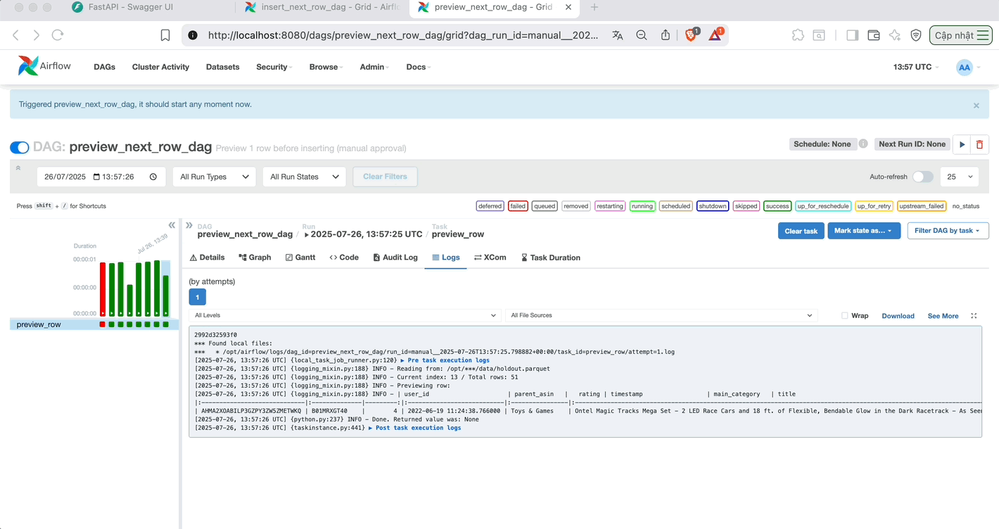

# Real-Time Data Pipeline on AWS

A production-ready, end-to-end data pipeline for real-time and batch processing using AWS services: **RDS PostgreSQL, Glue, Kinesis, DMS Serverless, Lambda**, and integration with a feature store. This pipeline supports both OLTP simulation and real-time feature engineering for downstream ML applications.

---

## 📋 Table of Contents

1. [Overview](#overview)
2. [Prerequisites](#prerequisites)
3. [Step 1: RDS PostgreSQL Setup](#step-1-rds-postgresql-setup)
4. [Step 2: Database Initialization](#step-2-database-initialization)
5. [Step 3: Data Preparation & Upload](#step-3-data-preparation--upload)
6. [Step 4: Glue Data Quality Scripts](#step-4-glue-data-quality-scripts)
7. [Step 5: AWS Glue Job Configuration](#step-5-aws-glue-job-configuration)
8. [Step 6: Real-Time CDC Streaming](#step-6-real-time-cdc-streaming)
9. [Step 7: DMS Task Setup](#step-7-dms-task-setup)
10. [Drift Checker Service](#drift-checker-service)
11. [Lambda for Real-Time Feature Store Update](#lambda-for-real-time-feature-store-update)
12. [Demo Workflow](#demo-workflow)

---

## Overview

This guide walks you through setting up a robust AWS-based data pipeline for both batch and streaming data, enabling real-time feature engineering and drift monitoring for ML systems.

---

## Prerequisites

- AWS account with admin privileges
- Familiarity with AWS (RDS, Glue, Kinesis, DMS, S3)
- Tools: DBeaver, AWS CLI (configured)
- Local clone of this repository

---

## Step 1: RDS PostgreSQL Setup

1. **Create RDS PostgreSQL instance**  
   - Engine: PostgreSQL 17.4-R1  
   - Template: Free Tier  
   - DB Instance Identifier: `simulate-oltp-db`  
   - Master Username/Password: `postgres`  
   - Public Access: Yes

   

2. **Note the RDS endpoint** (e.g., `simulate-oltp-db.cdkwg6wyo7r8.ap-southeast-1.rds.amazonaws.com`)

---

## Step 2: Database Initialization

Connect to RDS using DBeaver and run:

```sql
CREATE DATABASE raw_data;
CREATE DATABASE registry_feature_store;
```

- `raw_data`: OLTP simulation
- `registry_feature_store`: Feature store registry



---

## Step 3: Data Preparation & Upload

1. **Prepare Data**  
   - Run `notebooks/01-prep-data.ipynb` to sample and filter data.

2. **Upload Data**  
   - Run `notebooks/02-upload-data.ipynb` to upload to `raw_data.public.reviews` and S3 (`s3://recsys-ops/`).


---

## Step 4: Glue Data Quality Scripts

Upload DQDL scripts to S3:

```bash
aws s3 cp data_pipeline_aws/glue_data_quality/parent_asin_stats.dqdl s3://recsys-ops/dq/parent_asin_stats.dqdl
aws s3 cp data_pipeline_aws/glue_data_quality/user_stats.dqdl s3://recsys-ops/dq/user_stats.dqdl
```

---

## Step 5: AWS Glue Job Configuration

Create a Glue job (Spark 3.0) with parameters:

| Key             | Value                                                                 |
|-----------------|-----------------------------------------------------------------------|
| --AWS_REGION    | ap-southeast-1                                                        |
| --DB_CONNECTION | jdbc:postgresql://<RDS_ENDPOINT>:5432/raw_data                        |
| --DB_PASSWORD   | postgres                                                              |
| --DB_USERNAME   | postgres                                                              |
| --JOB_NAME      | FeastFeatureTransformJob                                              |
| --S3_BUCKET     | recsys-ops                                                            |
| --TABLE_NAME    | public.reviews                                                        |

- Glue job code: [`glue.py`](glue.py)

---

## Step 6: Real-Time CDC Streaming

### 6.1 Update RDS Parameter Group

Set parameters:

```
rds.logical_replication = 1
shared_preload_libraries = pg_stat_statements,pg_tle,pglogical
```

Reboot RDS after applying.


### 6.2 Enable `pglogical` Extension

```sql
CREATE EXTENSION IF NOT EXISTS pglogical;
```

### 6.3 Kinesis Data Stream

- Create a Kinesis Data Stream
- Create VPC endpoint and security group for Kinesis


### 6.4 AWS DMS Serverless

#### 6.4.1 Create DMS Role

Create IAM role for DMS with access to RDS and Kinesis.


#### 6.4.2 Create Source Endpoint

- Type: Source
- Database: `raw_data`
- Use RDS endpoint, username, password
- Test connection


#### 6.4.3 Create Target Endpoint

- Type: Target
- Service: Kinesis
- Test connection


---

## Step 7: DMS Task Setup

Create and start a DMS task to replicate data from RDS to Kinesis.


---

## Drift Checker Service

Monitor data drift in real-time from Kinesis and generate reports with Evidently.

### 1. Build Docker Image

```bash
cd check_drift
docker build -t nthaiduong83/drift-checker:v2 .
```

### 2. Run Drift Checker

```bash
docker run -it --rm \
  -e AWS_REGION="${AWS_REGION:-ap-southeast-1}" \
  -e AWS_ACCESS_KEY_ID="${AWS_ACCESS_KEY_ID}" \
  -e AWS_SECRET_ACCESS_KEY="${AWS_SECRET_ACCESS_KEY}" \
  -e STREAM_NAME=test \
  -e INTERVAL=1 \
  -e MIN_MESSAGES=3 \
  -e USE_RDS=1 \
  -e RDS_USERNAME=postgres \
  -e RDS_PASSWORD=postgres \
  -e RDS_HOST=simulate-oltp-db.cdkwg6wyo7r8.ap-southeast-1.rds.amazonaws.com \
  -e RDS_PORT=5432 \
  -e RDS_DATABASE=raw_data \
  -e RDS_SCHEMA=public \
  -e RDS_TABLE=reviews \
  -e S3_BUCKET=recsys-ops \
  -e S3_KEY=drift_report.html \
  nthaiduong83/drift-checker:v2
```

- Generates drift report and uploads to S3.


---

## Lambda for Real-Time Feature Store Update

Consume Kinesis records and update the online feature store.

### 1. Build & Push Lambda Container

```bash
cd data_pipeline_aws/lambda
aws ecr get-login-password --region ap-southeast-1 | \
docker login --username AWS --password-stdin 796973475591.dkr.ecr.ap-southeast-1.amazonaws.com

docker build -t 796973475591.dkr.ecr.ap-southeast-1.amazonaws.com/datn/feast-lambda:v2 .
docker push 796973475591.dkr.ecr.ap-southeast-1.amazonaws.com/datn/feast-lambda:v2
export $(grep -v '^#' ../../.env | xargs)
```

### 2. Deploy Lambda Function

- Create Lambda from container image
- Attach IAM role for Kinesis and feature store access
- Set timeout: **1 minute**
- Add env var:  
  - `REGISTRY_PATH=postgresql+psycopg2://postgres:postgres@<RDS_ENDPOINT>:5432/registry_feature_store`


---

## Demo Workflow

1. Preview new data to be updated
2. Check user's history in the online feature store
3. Insert new transaction (CDC → DMS → Kinesis → Lambda → Feature Store)
4. Recheck user's history for update



---
